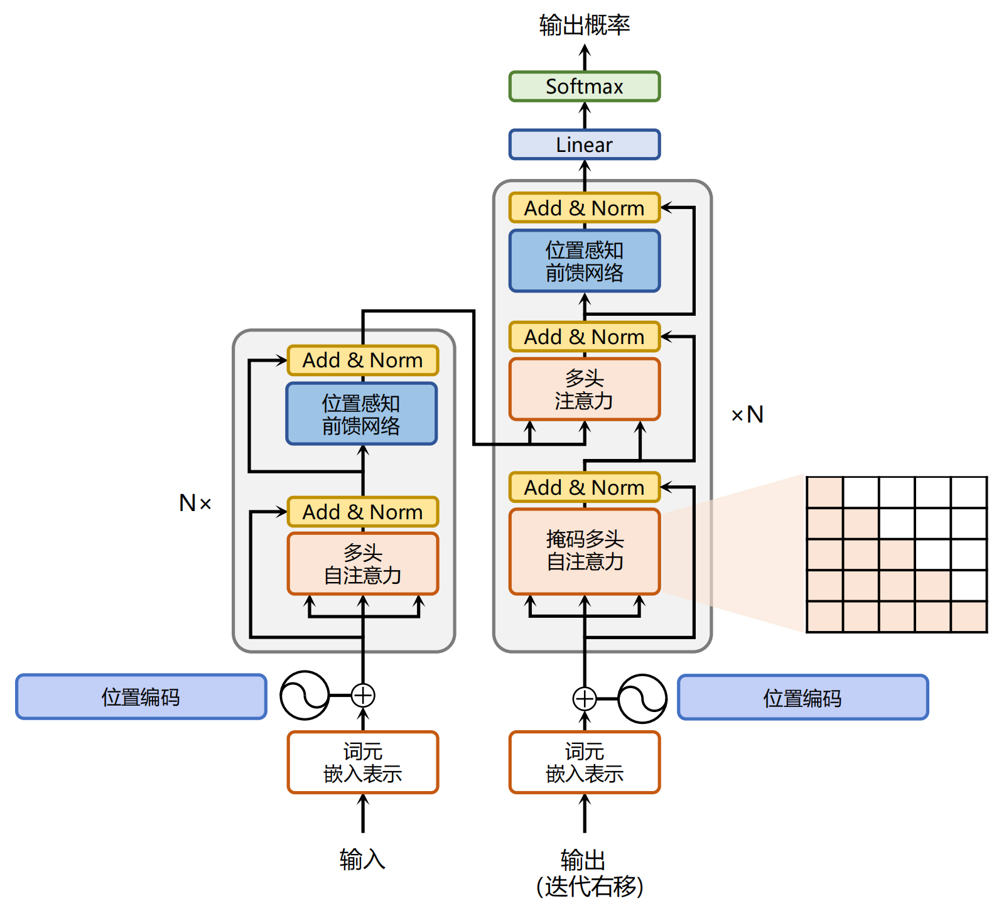

# 1 Transformer

## 1.1 整体结构

基于 Transformer 结构的编码器和解码器结构如图所示，左侧和右侧分别对应着编码器（Encoder）和解码器（Decoder）结构。它们均由若干个基本的 Transformer 块（Block）组成（对应着图中的灰色框）。这里 N× 表示进行了 N 次堆叠。每个 Transformer 块都接收一个向量序列 $\{\boldsymbol{x}_i\}_{i=1}^t$作为输入，并输出一个等长的向量序列作为输出 $\{\boldsymbol{y}_i\}_{i=1}^t$。这里的 $\boldsymbol{x}_i$ 和 $\boldsymbol{y}_i$ 分别对应着文本序列中的一个单词的表示，$\boldsymbol{y}_i$ 是当前 Transformer 块对输入 $\boldsymbol{x}_i$ 进一步整合其上下文语义后对应的输出。在从输入 $\{\boldsymbol{x}_i\}_{i=1}^t$到输出$\{\boldsymbol{y}_i\}_{i=1}^t$的语义抽象过程中，主要涉及到如下几个模块：

- **注意力层**：使用多头注意力（Multi-Head Attention）机制整合上下文语义，它使得序列中任意两个单词之间的依赖关系可以直接被建模而不基于传统的循环结构，从而更好地解决文本的长程依赖。
- **位置感知前馈层**（Position-wise FFN）：通过全连接层对输入文本序列中的每个单词表示进行更复杂的变换。
- **残差连接**：对应图中的 Add 部分。它是一条分别作用在上述两个子层当中的直连通路，被用于连接它们的输入与输出。从而使得信息流动更加高效，有利于模型的优化。
- **层归一化**：对应图中的 Norm 部分。作用于上述两个子层的输出表示序列中，对表示序列进行层归一化操作，同样起到稳定优化的作用。

## 1.2 模块原理

### （1）Position Embedding

对于输入文本序列，首先通过输入嵌入层（Input Embedding）将每个单词转换为其相对应的向量表示。通常直接对每个单词创建一个向量表示。由于 Transfomer 模型不再使用基于循环的方式建模文本输入，序列中不再有任何信息能够提示模型单词之间的相对位置关系。在送入编码器端建模其上下文语义之前，一个非常重要的操作是在词嵌入中加入位置编码（Positional Encoding）这一特征。

**正余弦（Sinusoidal）位置编码**：使用不同频率的正余弦函数进行位置编码。下面符号中，$\text{pos}$ 表示单词所在的位置，$2i$ 和 $2i+ 1$ 表示位置编码向量中的对应维度，$d$ 则对应位置编码的总维度。

$$
\begin{aligned}
\text{PE}(\text{pos}, 2i)&=2\sin(\frac{\text{pos}}{10000^{2i/d}})\\
\text{PE}(\text{pos}, 2i+1)&=2\cos(\frac{\text{pos}}{10000^{2i/d}})\\
\end{aligned}
$$

- 正余弦函数的范围是在 $[-1,+1]$，导出的位置编码与原词嵌入相加不会使得结果偏离过远而破坏原有单词的语义信息
- 依据三角函数的基本性质，可以得知第 $\text{pos} + k$ 个位置的编码是第 $\text{pos}$ 个位置的编码的线性组合，这就意味着位置编码中蕴含着单词之间的距离信息。

### （2）Self-Attention

通过三个线性变换$\boldsymbol{W^Q}\in \mathbb{R}^{d\times d_k}$、$\boldsymbol{W^K}\in \mathbb{R}^{d\times d_k}$、$\boldsymbol{W^V}\in \mathbb{R}^{d\times d_v}$，将词嵌入矩阵$X\in \mathbb{R}^{t\times d}$转化为$\boldsymbol{Q}\in \mathbb{R}^{t\times d_k}$、$\boldsymbol{K}\in \mathbb{R}^{t\times d_k}$、$\boldsymbol{V}\in \mathbb{R}^{t\times d_v}$，然后通过点积计算注意力分数（**注意除以$\sqrt{d}$**），最后经过Softmax进行归一化：

$$
Z = \text{Attention}(\boldsymbol{Q},\boldsymbol{K},\boldsymbol{V}) = \text{Softmax}(\frac{\boldsymbol{Q}\boldsymbol{K}^\top}{\sqrt{d}})\boldsymbol{V}
$$

为了进一步增强自注意力机制聚合上下文信息的能力，提出了**多头自注意力**（Multi-head Attention, MHA）的机制，以关注上下文的不同侧面。输入序列首先通过不同的权重矩阵被映射为一组查询、键和值。每组查询、键和值的映射构成一个“头”，并独立地计算自注意力的输出。最后，不同头的输出被拼接在一起，并通过一个权重矩阵$\boldsymbol{W^O}$进行映射，产生最终的输出。

$$
\begin{aligned}
head_i&=\text{Attention}(\boldsymbol{X}\boldsymbol{W^Q}_i,\boldsymbol{X}\boldsymbol{W^K}_i,\boldsymbol{X}\boldsymbol{W^V}_i)\\
\text{MHA}&=\text{Concat}(head_1, head_2, \cdots, head_n) \boldsymbol{W^O}
\end{aligned}
$$

### （3）Position-wise FFN

前馈网络层通过激活函数引入了**非线性映射变换**，提升了模型的表达能力，从而更好地捕获复杂的交互关系。（注意，经过FNN后$\boldsymbol{X}$的形状不发生变化，词向量的长度保持不变）

$$
\text{FNN}(\boldsymbol{X})=\sigma(\boldsymbol{X}\boldsymbol{W^U}+\boldsymbol{b}_i)\boldsymbol{W^D}+\boldsymbol{b}_2
$$

### （4）Add & Norm

残差连接主要是指使用一条直连通道直接将对应子层的输入连接到输出上去，从而避免由于网络过深在优化过程中潜在的梯度消失问题。

为了进一步使得每一层的输入输出范围平移缩放到均值为0，方差为1的标准分布，层归一化技术被进一步引入每个 Transformer 块的当中。

## 1.3 Encoder & Decoder

### （1）Encoder

编码器接受经过位置编码层的词嵌入序列$\boldsymbol{X}$作为输入，通过多个堆叠的编码器层来建模上下文信息，进而对于整个输入序列进行编码表示。由于输入数据是完全可见的，编码器中的自注意力模块通常采用**双向注意力**，每个位置的词元表示能够有效融合上下文的语义关系。在编码器-解码器架构中，编码器的输出将作为解码器（Decoder）的输入，进行后续计算。

### （2）Decoder

与编码器不同，解码器需要引入**掩码自注意力**（Masked Self-attention）模块，用来在计算注意力分数的时候掩盖当前位置之后的词，以保证生成目标序列时不依赖于未来的信息。除了建模目标序列的内部关系，解码器还引入了与编码器相关联的**交叉注意力层**，从而关注编码器输出的上下文信息，其中Query是通过解码器前一层的输出进行投影的，而Key和Value是使用编码器的输出进行投影的。在经过解码器之后，模型会通过一个全连接层将输出映射到目标词汇表的概率分布，并基于某种解码策略生成对应的词元。

在训练过程中，解码器可以通过一次前向传播，让每个词元的输出用于预测下一个词元。而在解码过程，解码器需要经过一个逐步的生成过程，将**自回归**地生成完整的目标序列。

## 1.4 技术细节

### （1）归一化方法

**LayerNorm** 针对数据进行逐层归一化。层归一化会计算每一层中所有激活值的均值$\mu$和方差$\sigma$，从而重新调整激活值的中心和缩放比例。

$$
\begin{aligned}
\text{LayerNorm}(\boldsymbol{x}) &= \frac{\boldsymbol{x}-\mu}{\sigma}\cdot \gamma+\beta\\
\mu&=\frac{1}{H}\sum_{i=1}^H x_i\\
\sigma&=\sqrt{\frac{1}{H}\sum_{i=1}^H (x_i-\mu)^2}
\end{aligned}
$$

**RMSNorm** 为了提高层归一化的训练速度，RMSNorm仅利用激活值总和的均方根RMS(x)对激活值进行重新缩放。使用 RMSNorm的Transformer模型相比于之前LayerNorm训练的模型在训练速度和性能上均具有一定优势。

$$
\begin{aligned}
\text{RMSNorm}(\boldsymbol{x})&=\frac{\boldsymbol{x}}{\text{RMS}(\boldsymbol{x})}\cdot \gamma\\
\text{RMS}(\boldsymbol{x})&=\sqrt{\frac{1}{H}\sum_{i=1}^H x_i^2}
\end{aligned}
$$

**DeepNorm** 旨在稳定深层Transformer的训练。在 LayerNorm 的基础上，在残差连接中对之前的激活值按照一定比例$\alpha$进行放缩。（注：Sublayer表示Transformer层中的前馈神经网络或自注意力模块）

$$
\text{DeepNorm}(\boldsymbol{x})=\text{LayerNorm}(\alpha\cdot\boldsymbol{x}+\text{Sublayer}(\boldsymbol{x}))
$$

### （2）归一化位置

**Post-Norm** 归一化模块被放置于残差计算之后。（1）有助于加快神经网络的训练收敛速度，使模型可以更有效地传播梯度；（2）降低神经网络对于超参数（如学习率、初始化参数等）的敏感性，使得网络更容易调优；但是（3）输出层附近存在梯度较大的问题，在训练过程中通常会出现不稳定的现象。Post-Norm很少被单独使用，通常是与其他策略相结合应用，例如DeepNorm

$$
\text{Post-Norm}(\boldsymbol{x}) = \text{Norm}(\boldsymbol{x} + \text{Sublayer}(\boldsymbol{x})),
$$

**Pre-Norm** 将归一化模块应用在每个子层之前。相较于 Post-Norm，Pre-Norm直接把每个子层加在了归一化模块之后，仅仅对输入的表示进行了归一化，从而可以防止模型的梯度爆炸或者梯度消失现象。虽然性能不如Post-Norm，但是保证了训练的稳定性。

$$
\text{Pre-Norm}(\boldsymbol{x}) = \boldsymbol{x} + \text{Sublayer}(\text{Norm}(\boldsymbol{x})),
$$

**Sandwich-Norm** 理论上具有更加灵活的表达能力，但是实验显示Sandwich-Norm有时仍然无法保证大语言模型的稳定训练，甚至会引发训练崩溃的问题。

$$
\text{Sandwich-Norm}(\boldsymbol{x}) = \boldsymbol{x} + \text{Norm}(\text{Sublayer}(\text{Norm}(\boldsymbol{x}))),
$$

### （3）激活函数

**ReLU** 将对输入中每个神经元和“零值”进行比较，并将小于零的神经元的值设置为0。然而，ReLU可能会产生神经元失效的问题，被置为0的神经元将学习不到有用的信息。

$$
\text{ReLU}(x)=\max(x,0)
$$

**Swish** 数将神经元和该神经元的 sigmoid 激活的乘积作为新的激活函数。

$$
\text{Swish}(x)=x\cdot \text{sigmoid}(x)
$$

**GELU** 利用标准高斯累积分布函数作为激活函数。

$$
\begin{aligned}
\text{GELU}(x)&=0.5 \cdot [1+\text{erf}(x/\sqrt{2})]\\
\text{erf}(x)&=\frac{2}{\sqrt{\pi}}\int_1^x e^{-t^2}\mathrm{d}t
\end{aligned}
$$

**GLU** 引入了两个不同的线性层。其中一个线性层的输出将被输入到一个激活函数（例如，GeGLU 采用 GELU 激活函数）中，其结果将和另一个线性层的输出进行逐元素相乘作为最终的输出。

$$
\text{GLU}(\boldsymbol{x})=\sigma(\boldsymbol{W^G}\boldsymbol{x})\odot (\boldsymbol{W^U}\boldsymbol{x})
$$

**SwiGLU** Swish结合GLU。

$$
\text{SwiGLU}(\boldsymbol{x})=\text{Swish}(\boldsymbol{W^G}\boldsymbol{x})\odot (\boldsymbol{W^U}\boldsymbol{x})
$$

**GeGLU** GELU结合GLU。

$$
\text{GeGLU}(\boldsymbol{x})=\text{GELU}(\boldsymbol{W^G}\boldsymbol{x})\odot (\boldsymbol{W^U}\boldsymbol{x})
$$

### （4）位置编码

**绝对位置编码** 原始的Transformer模型中正余弦位置编码属于绝对位置编码。绝对位置编码根据输入的词元在序列中的绝对位置生成唯一的位置嵌入，并与词元的嵌入表示进行相加来注入位置信息。早期PLM（例如BERT）采用绝对位置编码。

$$
\boldsymbol{x}_t=\boldsymbol{v}_t+\boldsymbol{p}_t
$$

**相对位置编码** 与绝对位置编码不同，相对位置编码是根据键和查询之间的偏移量计算得来的。计算得到的相对位置编码通常应用于注意力矩阵的计算中，而不是直接与词元本身的位置编码进行相加。与绝对位置编码相比，应用了相对位置编码的Transformer模型常常可以对比训练序列更长的序列进行建模，即具备一定的外推能力。

以T5为例，它在注意力分数中引入了可学习的标量$r_{i-j}$，这些标量是基于Query和Key的位置之间的距离计算的。

$$
A_{ij}=\boldsymbol{x_i}\boldsymbol{W^Q}\boldsymbol{W^K}x_j^\top+r_{i-j}
$$

**旋转位置编码**（RoPE） RoPE巧妙地使用了基于绝对位置信息的旋转矩阵来表示注意力中的相对位置信息。RoPE 根据位置信息为序列中每个词元所对应的设置了独有的旋转矩阵，并和对应的查询和键进行相乘进行融合。

形式化，位置索引$t$对应的旋转矩阵定义如下所示：

$$
\boldsymbol{R}_{\theta,t}=
\begin{bmatrix}
\cos t\theta_1&-\sin t\theta_1 & 0 & 0 & \cdots & 0 & 0 \\
\sin t\theta_1&\cos t\theta_1 & 0 & 0 & \cdots & 0 & 0 \\
0&0 & \cos t\theta_2&-\sin t\theta_2 & \cdots & 0 & 0 \\
0&0 & \sin t\theta_2&\cos t\theta_2 & \cdots & 0 & 0 \\
\vdots&\vdots & \vdots & \vdots & \ddots & 0 & 0 \\
0&0 & 0 & 0 & \cdots & \cos t\theta_{H/2}&-\sin t\theta_{H/2} \\
0&0 & 0 & 0 & \cdots & \sin t\theta_{H/2}&\cos t\theta_{H/2} \\
\end{bmatrix}
$$

利用旋转矩阵中三角函数的特性，位置索引为$i$的旋转矩阵和位置索引为$j$的旋转矩阵的转置的乘积等同于位置索引为它们相对距离$i-j$的旋转矩阵，即$\boldsymbol{R}_{\theta,i}\boldsymbol{R}_{\theta,j}^\top=\boldsymbol{R}_{\theta,i-j}$。

通过这种方式，键和查询之间的注意力分数能够有效融入相对位置信息。注意力矩阵的公式可以进一步变为如下形式：

$$
\begin{aligned}
\boldsymbol{q}_i&=\boldsymbol{x}_i\boldsymbol{W^Q}\boldsymbol{R}_{\theta,i}\\
\boldsymbol{k}_j&=\boldsymbol{x}_j\boldsymbol{W^K}\boldsymbol{R}_{\theta,j}\\
A_{ij}&=(\boldsymbol{x}_i\boldsymbol{W^Q}\boldsymbol{R}_{\theta,i})(\boldsymbol{x}_j\boldsymbol{W^K}\boldsymbol{R}_{\theta,j})^\top=\boldsymbol{x}_i\boldsymbol{W^Q}\boldsymbol{R}_{\theta,i-j} \boldsymbol{W^{K \ \top}}\boldsymbol{x}_j^\top
\end{aligned}
$$

根据旋转矩阵的定义，RoPE 在处理查询和键向量的时候，将每对连续出现的两个元素视为一个子空间。因此，对于一个长度为$H$的向量来说，将会形成$H/2$个这样的子空间。在这些子空间中，每一个子空间$i\in\{1,2,\cdots,H/2\}$所对应的两个元素都会根据一个特定的旋转角度$t\theta_i$进行旋转，其中$t$代表位置索引，而$\theta_i$表示该子空间中的基。

与正弦位置嵌入类似，RoPE 将基$\theta_i$定义为底数$b$（默认值是10000）的指数：

$$
\Theta = \{\theta_i=b^{-2(i-1)/H}| i\in \{1,2,\cdots,H/2\}\}
$$

进一步，每个子空间定义了波长$\lambda_i$，即在该子空间上完成一个完整周期（$2\pi$）旋转所需的距离：

$$
\lambda_i=2\pi b^{2(i-1)/H}=2\pi/\theta_i
$$

由于RoPE具有良好的性能以及长期衰减的特性，已经主流的大语言模型广泛采用，例如PaLM和LLaMA。
