# Cherry Studio使用指南

> Cherry Studio的官方中文指南在这里：[https://docs.cherry-ai.com/](https://docs.cherry-ai.com/)。本文章旨在提供一些API选型、API接入等方面的个人建议，其它细节或教程请移步官方文档。

## 1 为什么是Cherry Studio

[Cherry Studio](https://cherry-ai.com/)，官网介绍是一个“支持多服务商集成的AI对话客户端”。简单来说，就是能够在这个客户端内借助多种LLM API服务平台实现AI对话。

那为什么要AI对话客户端而不用官网呢？个人观点如下：

- 不同大模型的官网（例如ChatGPT、DeepSeek、Qwen等）比较分散。如果模型的回答无法满足需求，或者我们想对比不同模型的回答来择优采用，那么还需要在不同的官网之间跳转。
- 大模型官网和各种浏览器插件/扩展都依赖于浏览器，而客户端是独立于浏览器的，同时能提供更多功能。因此客户端的交互体验会更加友好。
- ~~还有一个原因是DeepSeek官网总是“网络繁忙”，不得不借助第三方的神秘力量...~~

市面上目前有很多开源的AI对话客户端了，这里不完全列举一些比较流行的Cherry Studio、Chatbox AI和AnythingLLM。

> 以下图片均来自官网，侵删

=== "Cherry Studio"
    [**产品官网**](https://cherry-ai.com/) | [**Github官网**](https://github.com/CherryHQ/cherry-studio)

    

=== "Chatbox AI"
    [**产品官网**](https://chatboxai.app/zh) | [**Github官网**](https://github.com/Bin-Huang/chatbox)

    

=== "AnythingLLM"
    [**产品官网**](https://anythingllm.com/) | [**Github官网**](https://github.com/Mintplex-Labs/anything-llm)

    

当然，选择哪款产品都没有问题，因为每个人的审美、功能需求都不同。我个人根据UI风格、易用性和功能性选择了Cherry Studio，它内部集成了很多常用的LLM API服务平台（包括国内的），减少了很多API的导入工作，同时能快速切换不同模型、具备知识库检索功能（虽然现在它的RAG召回准确率有待优化）。另外，Cherry Studio目前也在持续更新，尤其是近期v1.0.0版本新增了联网搜索，所以个人也看好Cherry Studio的发展前景。

!!! note
    虽然本文主要讲述如何配置Cherry Studio，但是其中大部分配置方法是适用于Chatbox AI、AnythingLLM等客户端的。~~所以也不白看~~

## 2 下载客户端

Cherry Studio的[官网](https://cherry-ai.com/)或[Github Release](https://github.com/CherryHQ/cherry-studio/releases)均可。

## 3 准备工作

### 3.1 LLM API的选择

现在提供LLM API的平台确实是百花齐放，不仅有官网提供的API，也有各个大厂依托云服务部署大模型并开放API。下面再不完全列举若干主流的且Cherry Studio支持的LLM API平台：

- 深度求索（DeepSeek）
- 月之暗面（Moonshot）
- 魔搭（ModelScope）
- 硅基流动（Siliconflow）
- 百度云千帆
- 阿里云百炼
- 火山引擎
- 腾讯混元
- ...

现在大多数LLM API其实都有新用户注册优惠，通常是赠送几百万token，超过免费限额后按照token收费。当然可以挨个薅羊毛，但是毕竟不是免费（而且R1等推理模型产生的token数量相比非推理模型要大很多）。

本文对API平台的推荐原则：==优先免费，且保证可用性==。对于大模型推理API，我推荐[**魔搭（ModelScope）**](https://www.modelscope.cn)。它提供了免费的API调用。当然，这里的免费其实是有限制的，即每天最多2000请求，且不支持高并发，但是这对于日常对话等非开发用途来说还是绰绰有余的。经过实测，API可用性可以得到保证，推理速度也是正常水平。

!!! note
    2025-02-28更新：OpenRouter的`deepseek/deepseek-r1:free`目前可用性还不错，token吞吐量比ModelScope大，所以可以优先用OpenRouter的R1，然后ModelScope做备用

同时，如果你有知识库检索需求的话，文本嵌入API（用于RAG的文本向量化）推荐[**硅基流动（Siliconflow）**](https://siliconflow.cn/zh-cn/models)的`BAAI/bge-m3`模型。它同样是免费的，且没有限额。

### 3.2 获取API Key

魔搭（ModelScope）和硅基流动（Siliconflow）的账户注册就不做赘述了。账号注册完成之后，分别如图获取API Key，用于获取模型访问权限。

=== "魔搭"
    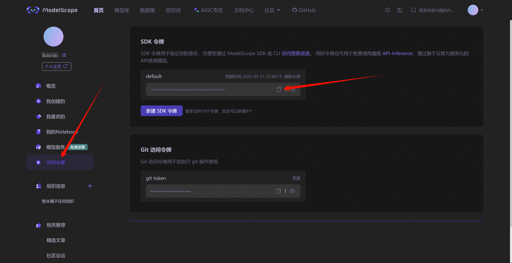

=== "硅基流动"
    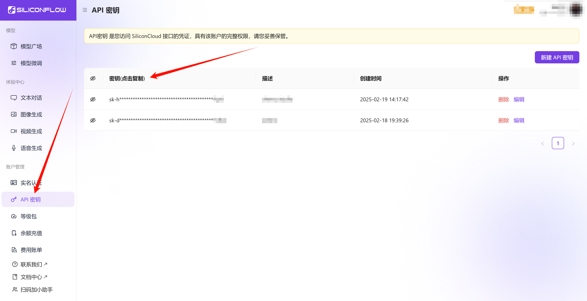

## 4 配置Cherry Studio

### 4.1 导入API密钥

!!! warning
    下面的图片中的某些布局细节可能与刚安装的Cherry Studio有所差异（因为我自己自定义过了QAQ），请忽略这些差异。

打开Cherry Studio，然后在界面左下角有一个齿轮状的配置按钮，点击进入配置界面，然后点击侧边栏的“模型服务”。

如下图所示，分别找到**ModelScope（魔搭）**和**硅基流动**。对于每个平台：

- 按照1号箭头检查平台是否启用
- 按照2号箭头粘贴对应的API key
- 按照3号箭头点击“检查”按钮，检查配置是否正确

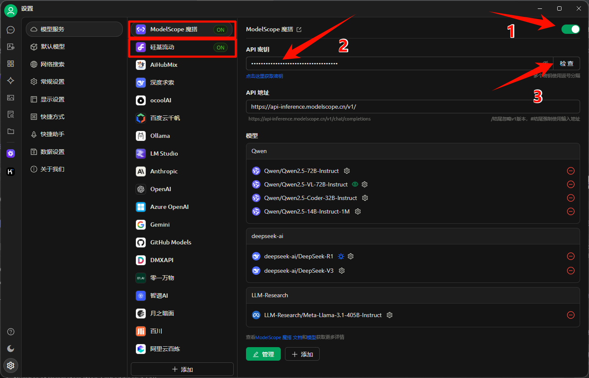

!!! note
    点击“检查”按钮后，会弹窗让选择模型。如果没有事先想要测试的模型的话，选择任意模型即可，然后点击确定。若弹窗显示“连接成功”则配置无误。

!!! info
    如果你想用其它平台的API但是Cherry Studio没有提供的话，可以点击下方“添加”来集成。
    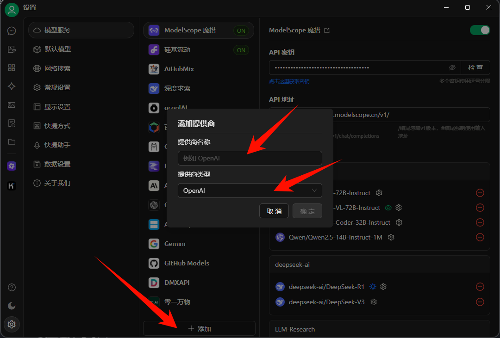
    这里提供商名称自己写就好，提供商类型一般都是兼容OpenAI的，所以大多数情况默认OpenAI就好，特殊情况可能要多查一查了。
    点击“确定”之后，需要填写API密钥和API地址。
    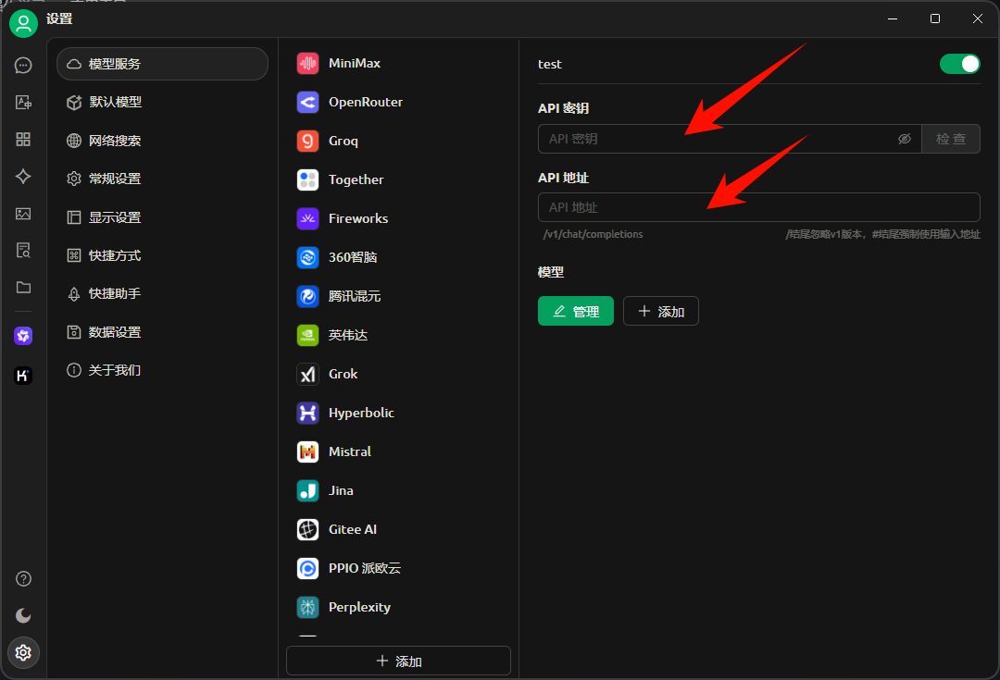
    API密钥像前面那样获取和粘贴即可。API地址需要去各个平台的指南/官方说明中获取。以ModelScope为例，API的`base_url`在这里：
    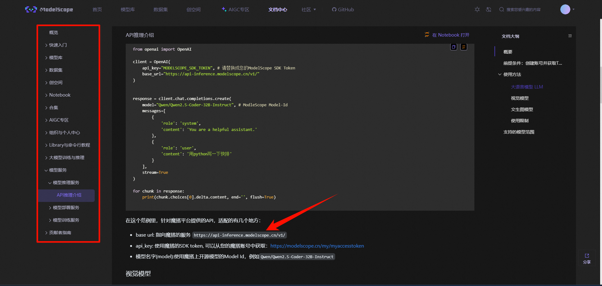

    !!! note
        兼容OpenAI的API使用说明可以参考[ModelScope API推理介绍](https://modelscope.cn/docs/model-service/API-Inference/intro)进行简单了解。

### 4.2 模型选择与导入

模型选择直接决定了用户的体验。下面我根据个人经验给出一些推荐：

- **复杂任务**，尤其涉及多步推理和验证的任务，优选`deepseek-ai/DeepSeek-R1`。R1目前仍然是最强大的开源推理大模型。此外，不要选择DeepSeek的蒸馏版本（DeepSeek-R1-Distill-xxx）。
- **简单任务**，例如自由问答、中英翻译，可以考虑`Qwen/Qwen2.5-72B-Instruct`、`LLM-Research/Meta-Llama-3.1-405B-Instruct`、`deepseek-ai/DeepSeek-V3`等。非推理类大模型处理简单任务一般问题不大，并且不会有冗杂的思考过程。
    - 代码类问题可以使用Coder模型，例如`Qwen/Qwen2.5-Coder-32B-Instruct`。不过，VSCode+Github Copilot或许是一个更好的选择。
- **长文本相关任务**，目前支持上下文最长的可能是`Qwen/Qwen2.5-14B-Instruct-1M`，支持1M上下文。现在模型一般支持上下文大概在128k左右，如果有处理特别长文本的需求，可以考虑用这个模型。

考虑好需要哪些模型之后，下面进行模型的导入。在Cherry Studio的对应平台配置界面的下方，有“管理”和“添加”两个按钮。优先点击“管理”按钮检查模型是否在列表中，如果有则直接导入即可，如果没有则点击“添加”按钮手动导入。

=== "点击“管理”按钮"
    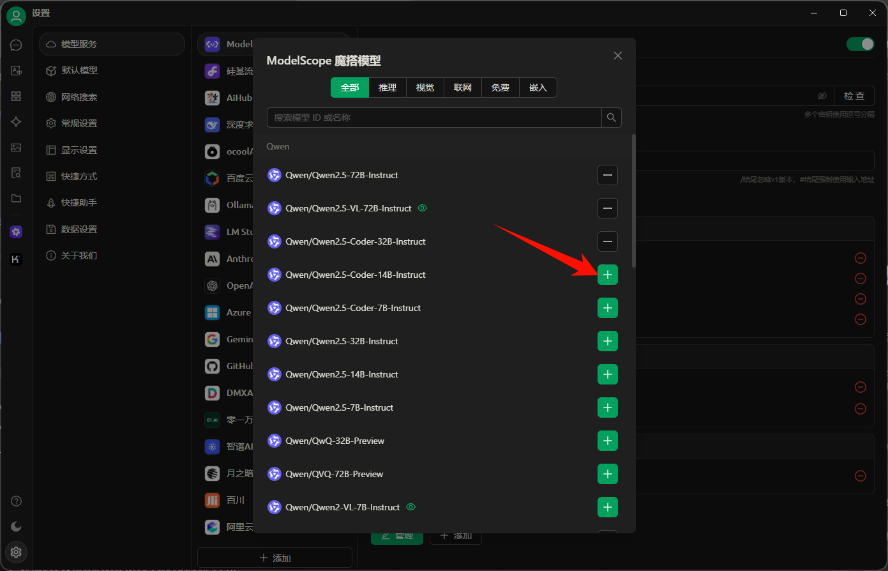

=== "点击“添加”按钮"
    首先打开[ModelScope模型库](https://modelscope.cn/models)查询模型id。可以在搜索框键入关键词，例如“DeepSeek”，然后点击模型进入详情页。
    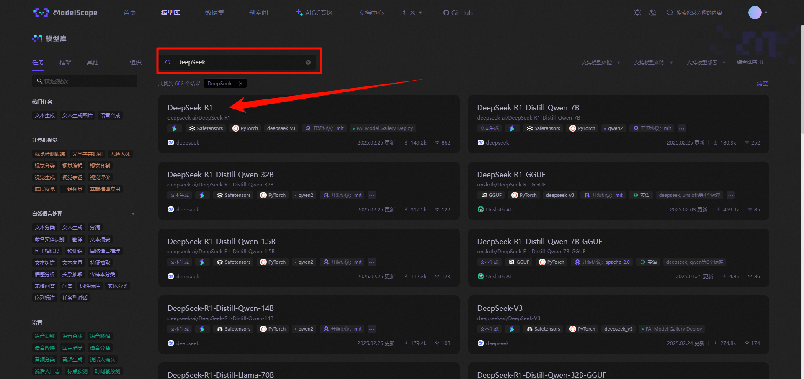
    在详情页中，模型名称下方的`AUTHOR/MODEL`格式的文字即为模型id，点击复制按钮。
    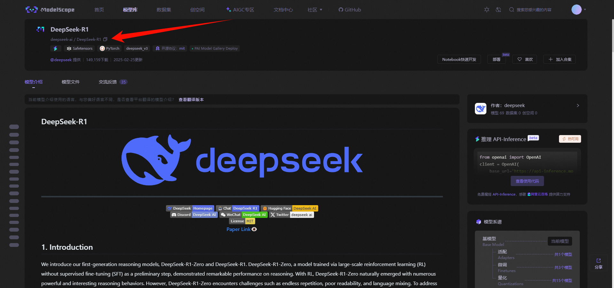
    回到Cherry Studio的配置界面，点击“添加”按钮，导入模型id，然后点击“添加模型”。
    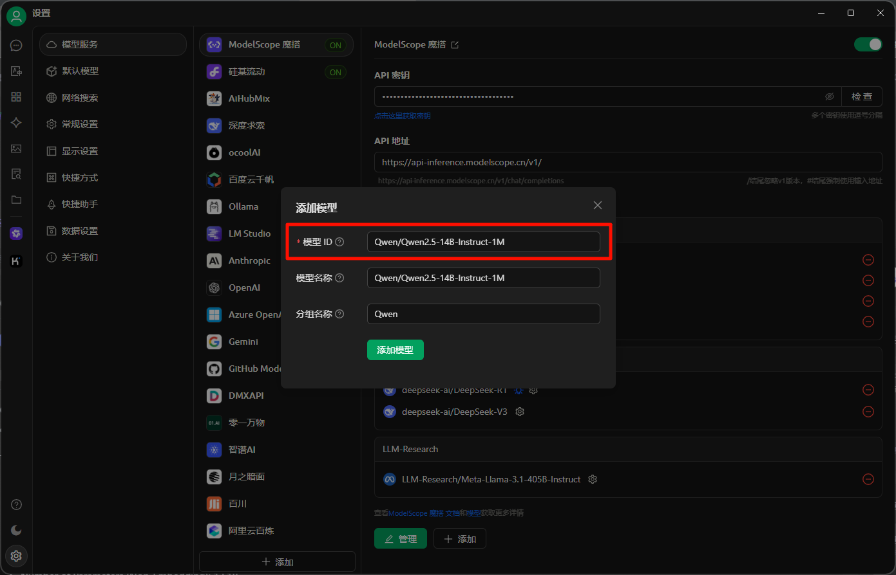

至此已经完成了大模型的导入。

!!! note
    上面介绍的内容理论上同样适用于其他AI对话客户端，无外乎是获取平台API key、选择模型、导入模型id和API key，三个步骤。

!!! note
    如果需要文本嵌入模型的话，前往“硅基流动”的配置界面，导入`BAAI/bge-m3`即可。

### 4.3 联网设置

Cherry Studio在v1.0.0版本更新了联网搜索功能，这能够让我们的体验更加接近DeepSeek官网（~~可能吧~~）。这一过程同样是注册、复制API key、粘贴API key，不再赘述了。

不过Cherry Studio集成的这个搜索工具是有限额的，每个月1000次请求。所以对时效性要求不高的任务可以关闭联网搜索避免超额。

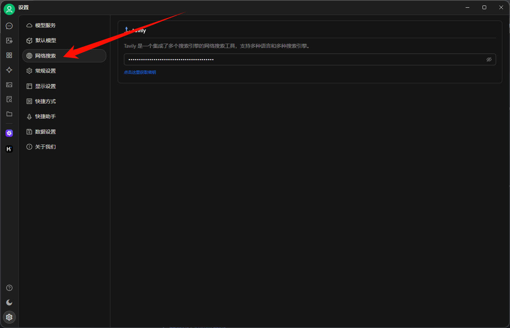

### 4.4 默认模型

这里给出的模型模型仅供参考。

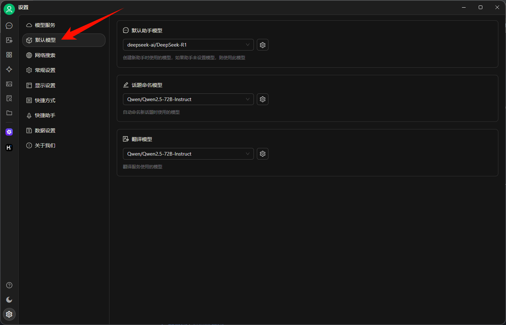

## 5 关于使用的碎碎念

### 5.1 切换模型

点击这两个地方可以选择不同的模型进行回答。其中下面的按钮仅用于当前对话，上面的按钮作用于全局会话。

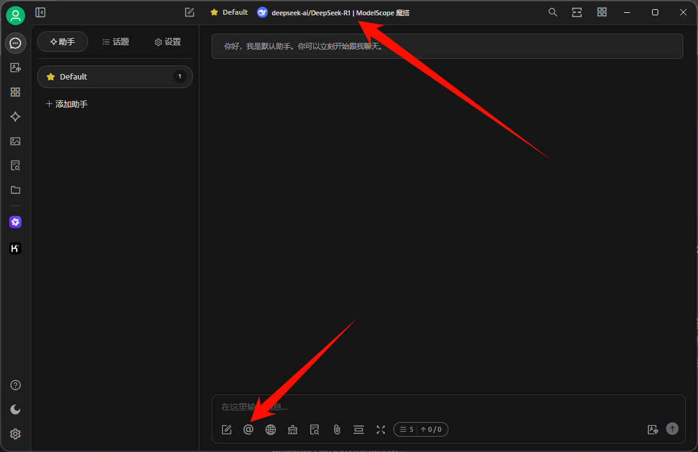

当然也可以同时让多个模型做出回答。

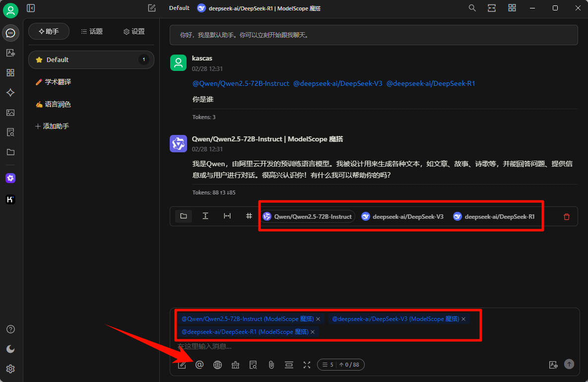

### 5.2 联网搜索

点击“开启联网搜索”按钮进行切换。

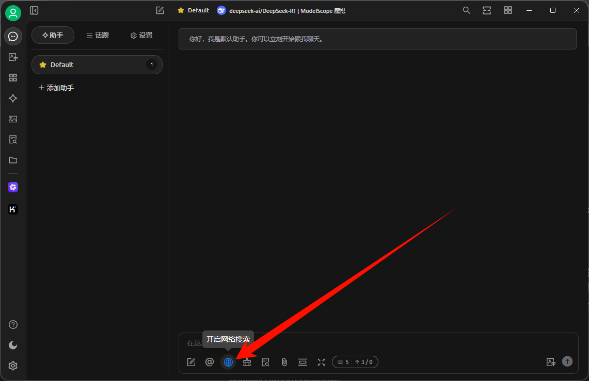

### 5.3 翻译功能

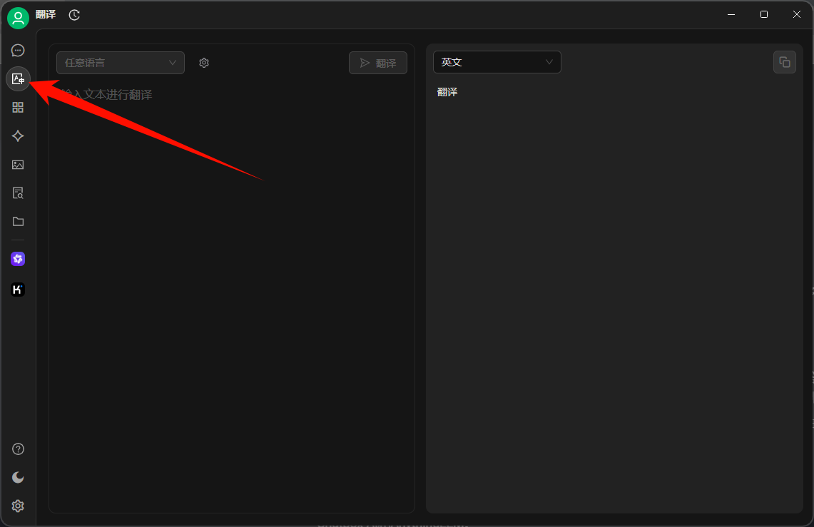

### 5.4 其它

文生图、知识库等功能我暂时没有深度使用，所以就交给你自由探索了=w=。
